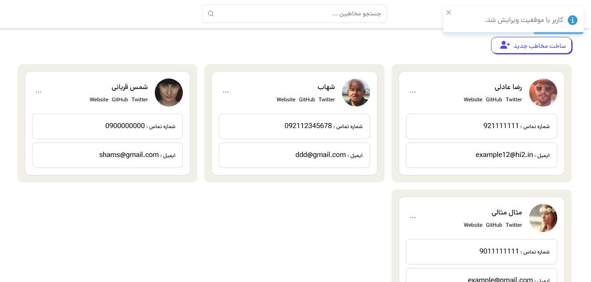

# Contact Manager App



A modern, responsive contact management application built with React and Vite. This application allows users to easily manage their contacts with a clean and intuitive interface.

## Features

- 📇 **Create, Read, Update, Delete (CRUD)** operations for contacts
- 🔍 **Search functionality** to quickly find contacts
- 🖼️ **Profile pictures** for each contact
- 🏷️ **Categorization** with custom groups/tags
- 🎨 **Responsive design** that works on all devices
- 🌙 **Dark mode support** for comfortable viewing
- ⚡ **Fast performance** with Vite development server
- 📱 **Mobile-friendly** interface
- ☁️ **Firebase integration** for real-time data synchronization

## Tech Stack

- **Frontend**: React 19, React Router v7
- **Build Tool**: Vite
- **Styling**: Tailwind CSS, Bootstrap
- **State Management**: use-immer, React Context API
- **Forms**: Formik with Yup validation
- **HTTP Client**: Firebase SDK
- **Notifications**: react-toastify
- **UI Components**: Custom components with React Confirm Alert
- **Backend**: Firebase Firestore

## Getting Started

### Prerequisites

- Node.js (v18 or higher recommended)
- npm or yarn

### Installation

1. Clone the repository:
   ```bash
   git clone https://your-repo-url/contact-manager-app.git
   ```

2. Install dependencies:
   ```bash
   cd contact-manager-app
   npm install
   ```

### Running the Application

To start the frontend development server:

```bash
npm run dev
```

This will start the development server on http://localhost:5173

Note: Unlike the previous version, we now use Firebase as our backend, so there's no separate server to run.

### Building for Production

To create a production build:

```bash
npm run build
```

### Previewing Production Build

To preview the production build locally:

```bash
npm run preview
```

## Project Structure

```
contact-manager-app/
├── public/              # Static assets
├── src/
│   ├── components/      # React components
│   ├── context/         # React context for state management
│   ├── helpers/         # Utility functions
│   ├── services/        # API service functions (now using Firebase)
│   ├── validations/     # Form validation schemas
│   ├── App.jsx          # Main application component
│   └── main.jsx         # Entry point
└── ...
```

## Key Components

- **Contacts**: Main dashboard displaying all contacts
- **AddContact**: Form for creating new contacts
- **EditContact**: Form for editing existing contacts
- **ViewContact**: Detailed view of a single contact
- **SearchContact**: Search bar for filtering contacts

## Firebase Configuration

This application now uses Firebase Firestore as its backend. The Firebase configuration is located in `src/services/firebaseConfig.js`.

To set up your own Firebase project:

1. Create a Firebase project at [Firebase Console](https://console.firebase.google.com/)
2. Create a Firestore database
3. Register your web app and replace the configuration in `src/services/firebaseConfig.js`
4. Create `contacts` and `groups` collections in Firestore
5. Add documents to the collections as needed

## Deployment

See [DEPLOYMENT.md](DEPLOYMENT.md) for detailed instructions on how to deploy this application to various hosting platforms like Vercel, Netlify, or GitHub Pages.

## Contributing

Contributions are welcome! Feel free to open issues or submit pull requests to improve the application.

## License

This project is licensed under the MIT License.